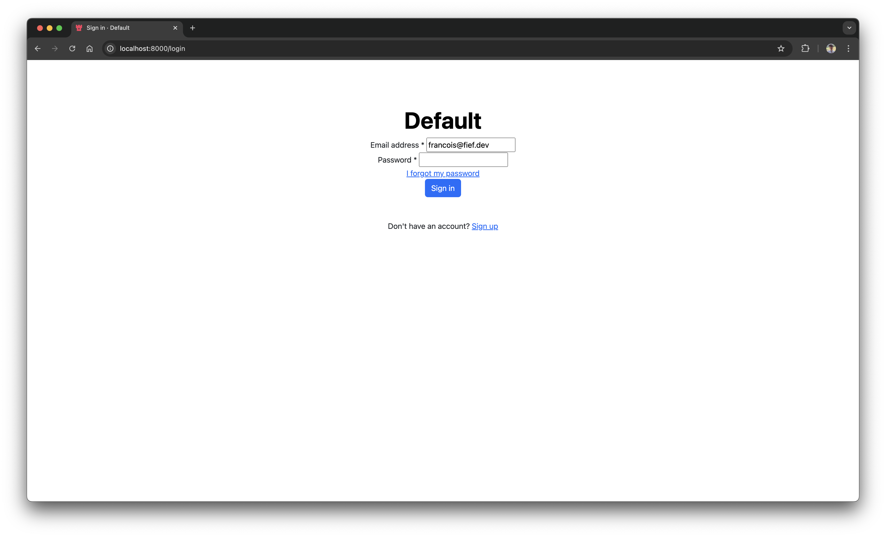

---
hide:
  - navigation
---

# Stronghold

Fief Stronghold is the **private edition** of Fief, accessible to our paid backers, which includes exclusive features.

* [X] [Hide Fief branding on authentication pages](#hide-fief-branding)
* [X] [Override authentication page templates](#override-authentication-page-templates)

[Get access](https://polar.sh/fief-dev){ .md-button }
{: .buttons }

## Usage

Fief Stronghold is only accessible through the [Docker image](https://github.com/fief-dev/stronghold/pkgs/container/stronghold). Since it's a private repository, you'll need to [authenticate your Docker CLI to GitHub Registry](https://docs.github.com/en/packages/working-with-a-github-packages-registry/working-with-the-container-registry#authenticating-to-the-container-registry).

Basically, you'll need to generate a [Personal access tokens (classic) on GitHub](https://github.com/settings/tokens), with at least the `repo` and `read:packages` scopes.

Then, you can authenticate your Docker CLI:

```sh
docker login ghcr.io
```

You'll then be prompted for your **GitHub Username**, and the token you just created as **password**.

Finally, you'll be able to pull the image:

```sh
docker pull ghcr.io/fief-dev/stronghold:latest
```

You can now swap the Fief image by the Stronghold one. Configuration and usage is common.

## Features

### Hide Fief branding

To hide Fief branding on authentication pages, you can set the environment variable `BRANDING` to `False`.

```ini
# .env
BRANDING=False
```

### Override authentication page templates

If you want to fully customize authentication pages (login, registration, forgot password, etc.), you can override the built-in templates. Fief templates are powered by [Jinja](https://jinja.palletsprojects.com/en/3.1.x/), a powerful templating system for Python.

#### Step 1: implement your templates

We recommend you to start from the [built-in templates](https://github.com/fief-dev/fief/tree/main/fief/templates/auth) of Fief and copy them into a local folder. The files you override should have the **same name** as the original ones and nested in a folder named `auth`.

Here is a simple example of an override of `layout.html`, which is the base layout for all authentication pages, using the [Bootstrap framework](https://getbootstrap.com/).

```py title="templates/auth/layout.html"
--8<-- "examples/stronghold-templates/templates/auth/layout.html"
```

#### Step 2: adding your templates to your Docker build

You should now add your templates to your Docker image. For this, create a `Dockerfile` (if not already) in your project. In its simplest form, it can look like this:

```dockerfile title="Dockerfile"
--8<-- "examples/stronghold-templates/Dockerfile"
```

Basically, we start from the base Stronghold image, copy our templates and set the `OVERRIDE_TEMPLATES_DIRECTORY` environment variable.

!!! tip "You don't need to override every files"
    If you just want to override some files but not the others, you can just provide the one you're interested in. If some templates don't exist, Fief will simply fall back to the default ones.

#### Step 3: build and run your image

Now, all you need is to build and run your image to see the result.

```sh
docker build -t stronghold-templates .
```


